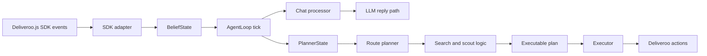

# LLM-Agent Context and Architecture

This document is a repo-level orientation guide for coding agents working on `llm-agent`. The chat/LLM feature is only a small extension here. The main body of the project is the Deliveroo BDI agent: beliefs, planner state, search, scout planning, route planning, and execution.

## What This Project Is

`llm-agent` is a Node.js Deliveroo.js agent built around a classical observe → believe → plan → execute loop.

At runtime it:

1. connects to the Deliveroo.js server,
2. listens to SDK events,
3. updates a partial internal world model,
4. builds planner input from beliefs,
5. runs the route planner and search logic,
6. translates the selected route into executable actions,
7. executes actions through the SDK,
8. replans when the world changes.

The LLM chat processor exists, but it is not the core architecture. The core architecture is the BDI agent.

## Task Setting

Changes in this repo should usually be incremental and local. The goal is to preserve the existing control loop while improving the agent’s reasoning, planning, sensing, and execution.

What matters most:

- keep beliefs, planning, search, and execution separated,
- preserve the closed-loop BDI structure,
- make planner behavior explainable from the code,
- keep Deliveroo event handling defensive and normalized,
- keep the code modular enough for later agent-focused edits.

What to avoid unless explicitly requested:

- collapsing everything into one script,
- mixing planner/search logic with transport and SDK glue,
- treating the LLM flow as the main system,
- adding debug-only metadata that does not help the actual agent.

## Repository Shape

The relevant repo structure is:

- `src/index.js`: runtime entrypoint and lifecycle wiring,
- `src/config.js`: environment configuration,
- `src/state/`: belief model, planner-state conversion, SDK event adapter,
- `src/control/`: main loop and chat processor,
- `src/planner/`: planner, search, pathfinding, scoring, scout logic,
- `src/executor/`: execution of movement, pickup, putdown, and chat send actions,
- `src/telemetry/`: runtime metrics and action tracking,
- `src/utils/`: geometry and logging helpers,
- `Deliveroo.js/`: environment, backend, frontend, SDK, and game docs.

## Runtime Flow



The chat path and the planning path use the same beliefs, but they are intentionally decoupled.

The ordering is important:

- incoming chat is queued in beliefs,
- the loop consumes chat first,
- then the agent continues with planning/execution,
- the executor is the only module that sends actions back to Deliveroo.

## Main Runtime Entry Points

### `src/index.js`

This is the startup file.

Responsibilities:

- load `.env` via `dotenv/config`,
- create the Deliveroo socket with `DjsConnect(...)`,
- create `BeliefState` and `AgentLoop`,
- register SDK listeners,
- start the loop on connect,
- stop the loop and disconnect on shutdown.

### `src/config.js`

This maps environment variables into a structured config object.

Key fields:

- `HOST`, `TOKEN`, `AGENT_NAME`, `LOG_LEVEL`, `ACTION_DELAY_MS`,
- `ADMIN_ID` for chat filtering,
- `planner.*` for tuning the search/planning/scout behavior.

### `src/state/sdk-adapter.js`

This is the boundary between Deliveroo SDK events and internal beliefs.

Responsibilities:

- normalize `you`, `tile`, and chat payload shapes,
- update beliefs for map, parcels, agents, and sensing,
- queue chat messages into beliefs,
- optionally filter chat to only the configured admin id,
- never plan or execute actions.

### `src/state/belief-state.js`

This is the agent’s internal world model.

It stores:

- self state,
- map dimensions and tiles,
- observed parcels and carried parcels,
- nearby agents,
- temporary blocked cells and edges,
- visited positions and edges,
- scout target history,
- replanning events,
- recent chat messages.

This state is partial by design. It represents what the agent knows, not the full world.

### `src/control/agent-loop.js`

This is the control layer.

Responsibilities:

- run the periodic tick,
- advance belief time and process events,
- process pending chat before planning continues,
- decide when replanning is required,
- build planner state,
- create route plans and executable plans,
- execute actions one by one,
- track failures, blocked moves, and telemetry.

### `src/executor/executor.js`

This turns abstract actions into SDK calls.

Responsibilities:

- `move(...)`, `pickUp(...)`, `putDown(...)`,
- `writeMessage(...)` for chat replies,
- push failure/success events back into beliefs,
- record telemetry,
- mark temporary blocks when movement fails.

### `src/control/chat-processor.js`

This is a small side module for the LLM-backed chat flow.

It is intentionally separate so the main loop stays readable.

## BDI Architecture

The BDI side is a standard closed loop:

1. observe via SDK events,
2. update beliefs,
3. build planner input,
4. replan if necessary,
5. execute the next action,
6. repeat.

### Belief Model

The belief layer is the agent’s memory.

Important concepts:

- `me`: current self state,
- `tiles`, `width`, `height`: map geometry,
- `parcels`: parcels currently believed to exist,
- `carriedParcels`: parcels already picked up,
- `agents`: observed other agents,
- `temporaryBlockedCells` and `temporaryBlockedEdges`: recent failures and short-lived obstacles,
- `visitedPositions`, `visitedEdges`: exploration history,
- `events`: replanning triggers,
- `chatInbox`: queued messages for the chat path.

It also stores sticky manual overlays and tasks:

- `manualTasks`: queued explicit goto tasks from chat tools,
- `forbiddenTiles`: manually forbidden walkability overrides,
- `pickupTileMultipliers`: pickup-value multipliers by tile,
- `deliveryTileMultipliers`: delivery-value multipliers by tile,
- `deliveryCountMultipliers`: delivery-value multipliers by delivered package count.

These overlays are planner-facing constraints/preferences. They are intentionally separate from base map observation updates.

Beliefs are deliberately mutable and event-driven. The planner reads them, but does not own them.

### Planner-State Conversion

`src/state/planner-state.js` converts beliefs into a normalized planning view.

It prepares data for the planner such as:

- current position,
- visible parcels,
- delivery tiles,
- enemy agents,
- carried packages,
- visited/blocked information,
- map profile and planner params.

This module is the bridge between raw belief memory and search-ready planner input.

## Planning and Search

The planning stack is the heart of the repo.

### `src/planner/route-planner.js`

This module selects the next high-level route plan.

Its job is not to emit actions directly. It chooses a route-level intention, then lets the executable-plan layer turn that into SDK actions.

Main responsibilities:

- parse and profile the map,
- choose planner parameters from the map shape,
- score green parcel candidates,
- build candidate route plans,
- choose between pickup, delivery, scout, local explore, and idle behavior,
- fall back safely when a plan is invalid or empty.

### Plan Families

The agent can produce several route modes:

- `PICKUP_DELIVERY`: collect parcels and deliver them,
- `DELIVERY_ONLY`: go deliver carried parcels,
- `PICKUP_ONLY`: move to a parcel without delivery completion yet,
- `OPPORTUNISTIC_PICKUP`: take a nearby parcel while already moving,
- `SCOUT`: general exploration scouting,
- `DENSE_SCOUT`: targeted exploration in dense green regions,
- `GREEN_EXPOSURE_SCOUT`: short path that reveals new parcel information,
- `LOCAL_EXPLORE`: simple local fallback movement,
- `IDLE`: no useful action found.

`OPPORTUNISTIC_PICKUP` now uses multiplier-aware projected delivery gain when evaluating whether to detour, so opportunistic behavior is aligned with the same delivery-value model used by planner search.

### Candidate Green Selection

The planner uses `src/planner/scoring/green-scorer.js` to rank parcel opportunities.

The scoring logic balances:

- current parcel value,
- future value after decay,
- confidence,
- distance from the agent,
- distance to the nearest delivery tile,
- whether enemies are likely to beat the agent to the parcel.

Important functions include:

- `currentGreenValue(...)`,
- `futureGreenValue(...)`,
- `computeGreenScore(...)`,
- `computeGreenScores(...)`,
- `selectCandidateGreens(...)`.

Candidate selection is intentionally filtered. Low-confidence, unreachable, or unprofitable parcels are excluded.

### Search Over Pickup/Delivery Sequences

`src/planner/search/plan-search.js` performs the beam search over route-level sequences.

It starts from `START` and extends partial plans with:

- green parcel points,
- red delivery points.

Core search concepts:

- `initialPlan(...)`: starting state,
- `extendToGreen(...)`: append a pickup target,
- `extendToRed(...)`: append a delivery target,
- `planValue(...)`: objective for partial plans,
- `finalObjective(...)`: objective for completed plans,
- `findBestSequence(...)`: beam search over sequence candidates.

The search is not a full-state solver. It is a guided sequence search over a reduced set of points of interest.

Delivery scoring (`computeDeliveredValue(...)`) applies:

- delivery tile multipliers,
- delivery count multipliers (exact count rules like `1 -> 0x`, `3 -> 3x`),
- multiplicative composition between both.

### Distance Oracle and Path Reconstruction

`src/planner/path/distance-oracle.js` builds pairwise paths between important points.

It caches the cost and path for every important pair such as:

- `START -> selected green`,
- `green -> red`,
- `START -> red` when needed.

This avoids repeating expensive path searches during the higher-level search.

`reconstructGridPath(...)` then turns the selected point sequence back into a full grid path.

### Pathfinding

`src/planner/path/pathfinder.js` and `src/planner/path/grid-utils.js` provide the low-level grid logic.

They handle:

- tile normalization,
- walkability and direction constraints,
- grid bounds,
- BFS/A* path search,
- directed movement rules,
- grid profile detection.

The planner chooses the cheapest suitable path method based on map structure:

- uniform-cost open maps can use BFS-style logic,
- constrained maps use A* or directed shortest paths,
- directed tiles and temporary blocks are respected.

### Scout Planning

`src/planner/scout/scout-planner.js` chooses exploration actions when parcel delivery is not the right move.

Scout logic is based on information gain and map coverage rather than parcel reward.

It can build different styles of scouting behavior:

- cluster-based scouting,
- dense-green scouting,
- green-exposure scouting,
- local exploration fallback.

The scout planner evaluates things like:

- how much new area becomes visible,
- whether the target is near stale green information,
- whether the waypoint is near delivery tiles,
- whether the target is too risky or too recently visited.

### Executable Plan Construction

`src/planner/executable-plan.js` translates route plans into concrete step-by-step actions.

The conversion usually produces:

- `move` actions along a path,
- `pick_up` when arriving at a parcel target,
- `put_down` when arriving at a delivery tile.

This module is deliberately narrow: it does not decide the route, only how to realize it as actions.

## Planning Inputs and Parameters

### `src/planner/default-params.js`

This exposes the default planner tuning values by freezing the planner config from `CONFIG.planner`.

### `src/config/tunable-params.js`

This file documents or centralizes which parameters can be tuned. The exact values matter less than the fact that the planner is parameterized rather than hard-coded.

### Major Tuning Areas

The planner parameters cover:

- parcel value and decay,
- search beam width and max sequence depth,
- scouting and exploration weights,
- enemy safety margins,
- blocked tile behavior,
- opportunistic pickup thresholds,
- map density thresholds,
- replanning intervals and budgets.

These parameters are important because most behavior changes should happen here before changing the planner structure.

## Execution and Replanning

### Execution Flow

Once a route plan becomes executable:

1. the executor runs the next action,
2. success advances the action index,
3. failure marks the plan invalid or temporarily blocked,
4. the loop updates beliefs and telemetry,
5. the next tick decides whether to continue or replan.

### Replanning Triggers

The loop replans when:

- there is no current plan,
- the current plan has finished,
- a move fails,
- pickup or putdown fails,
- parcels appear or disappear,
- the map changes enough to invalidate the current path,
- enemies or temporary blocks matter to the current route,
- periodic replanning thresholds are reached.

The agent is therefore reactive, not static.

## Chat as a Minor Extension

The current codebase also contains a chat path.

That path:

- receives `msg` events from Deliveroo,
- normalizes and stores them in beliefs,
- optionally filters to the admin id,
- lets the loop process pending chat before planning,
- sends replies through the executor.

This exists for the LLM integration work, but it should remain a side concern in the documentation and code structure.

### Current Chat Tooling Surface

Actionable chat instructions are expected to map to tools, not raw JSON replies. Current tool families include:

- explicit manual movement: `set_explicit_plan` (single target or sequence via `targets`),
- sticky map constraints: `set_forbidden_tile`,
- sticky pickup-value rules: `set_pickup_tile_multiplier`,
- sticky delivery-tile rules: `set_delivery_tile_multiplier`,
- sticky delivery-count rules: `set_delivery_count_multiplier`,

These commands update belief overlays/events and trigger replanning through normal loop invalidation.

## Deliveroo.js Environment Context

The agent runs inside Deliveroo.js, a grid-based educational parcel game.

### Game Model

Deliveroo.js is a multiplayer grid world where agents:

- move on cells,
- pick up parcels,
- deliver parcels to red tiles,
- receive partial observations,
- can be blocked by walls, directional tiles, or other agents.

### Tile Semantics

The code uses the standard Deliveroo tile codes:

- `0`: wall or blocked,
- `1`: green parcel-spawning tile,
- `2`: red delivery tile,
- `3`: walkable tile.

The planner also supports directional / constrained tiles that affect entry and exit movement.

### SDK-Level Interaction

The agent uses the Deliveroo.js SDK client.

Key capabilities include:

- connection and disconnect lifecycle,
- `you` / self updates,
- `map` and `tile` updates,
- `agentsSensing` and `parcelsSensing`,
- broader `sensing` updates,
- movement actions,
- pickup and putdown actions,
- chat / message events.

The source code indicates the environment supports message-style interaction and actions such as say, shout, and ask/emit-style messaging depending on the SDK/client layer.

### Environment Docs in `Deliveroo.js/`

The external environment folder contains useful documentation and configuration references:

- `Deliveroo.js/README.md`: game overview, controls, and local run notes,
- `Deliveroo.js/backend/API.md`: configuration API and socket events,
- `Deliveroo.js/backend/CONFIGURATION.md`: game configuration and level loading,
- `Deliveroo.js/backend/src/ioServer.js`: socket wiring, admin handling, and server-side event routing.

This matters because many agent behaviors depend on what the backend emits and what the SDK accepts.

## Important Files to Start From

If you need to change behavior, start in this order:

1. `src/index.js` for startup and lifecycle,
2. `src/state/sdk-adapter.js` for incoming events,
3. `src/state/belief-state.js` for memory and event bookkeeping,
4. `src/state/planner-state.js` for planner input shape,
5. `src/planner/route-planner.js` for route selection,
6. `src/planner/search/plan-search.js` for pickup/delivery search,
7. `src/planner/scout/scout-planner.js` for exploration decisions,
8. `src/planner/path/` for path cost and reachability,
9. `src/planner/executable-plan.js` for action conversion,
10. `src/executor/executor.js` for environment actions.

## Current Behavior Summary

The current system is best understood as a BDI agent with a partial world model and a modular planning stack.

The loop is:

1. receive environment events,
2. update beliefs,
3. build planner state,
4. score candidate parcels and scout opportunities,
5. search over pickup/delivery sequences,
6. reconstruct the grid path,
7. convert the route into executable actions,
8. execute them,
9. replan when the world changes.

That is the main architecture. The LLM chat layer is a small adjacent feature, not the center of the repo.

Recent additions relevant to planner behavior:

- sticky forbidden-tile overlay is enforced by planner/path walkability checks,
- explicit goto tasks are queued and consumed through `manualTasks`,
- reward shaping supports pickup tile, delivery tile, and delivery count multipliers,
- opportunistic pickup selection estimates projected delivery gain using multiplier-aware delivery scoring rather than raw parcel reward only.

## Verification Notes

Typical quick checks:

```bash
npm test
npm start
```

`npm test` is mostly a smoke check here. Real validation still depends on a running Deliveroo environment and whatever runtime credentials are needed for the agent.
