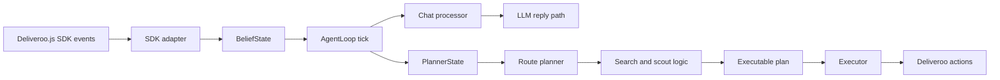

# LLM-Agent Context and Architecture

This document is a repo-level orientation guide for coding agents working on `llm-agent`. The chat/LLM feature is only a small extension here. The main body of the project is the Deliveroo BDI agent: beliefs, planner state, search, scout planning, route planning, and execution.

## What This Project Is

`llm-agent` is a Node.js Deliveroo.js agent built around a classical observe → believe → plan → execute loop.

At runtime it:

1. connects to the Deliveroo.js server,
2. listens to SDK events,
3. updates a partial internal world model,
4. builds planner input from beliefs,
5. runs the route planner and search logic,
6. translates the selected route into executable actions,
7. executes actions through the SDK,
8. replans when the world changes.

The LLM chat processor exists, but it is not the core architecture. The core architecture is the BDI agent.

## Task Setting

Changes in this repo should usually be incremental and local. The goal is to preserve the existing control loop while improving the agent’s reasoning, planning, sensing, and execution.

What matters most:

- keep beliefs, planning, search, and execution separated,
- preserve the closed-loop BDI structure,
- make planner behavior explainable from the code,
- keep Deliveroo event handling defensive and normalized,
- keep the code modular enough for later agent-focused edits.

What to avoid unless explicitly requested:

- collapsing everything into one script,
- mixing planner/search logic with transport and SDK glue,
- treating the LLM flow as the main system,
- adding debug-only metadata that does not help the actual agent.

## Repository Shape

The relevant repo structure is:

- `src/index.js`: runtime entrypoint and lifecycle wiring,
- `src/config.js`: config factory and shared planner defaults,
- `src/state/`: belief model, planner-state conversion, SDK event adapter,
- `src/control/`: main loop and control-layer helpers,
- `src/llm/`: optional LLM chat subsystem,
- `src/planner/`: planner, search, pathfinding, scoring, scout logic,
- `src/executor/`: execution of movement, pickup, putdown, and chat send actions,
- `src/telemetry/`: runtime metrics and action tracking,
- `src/utils/`: geometry and logging helpers,
- `Deliveroo.js/`: environment, backend, frontend, SDK, and game docs.

## Runtime Flow



The chat path and the planning path use the same beliefs, but they are intentionally decoupled.

The ordering is important:

- in `llm` mode with chat enabled, admin chat is queued in beliefs and non-release teammate chat is also visible to the chat path,
- in `bdi` mode with `TEAMMATE_ID` configured, direct chat from that teammate can be parsed as sync messages and applied to beliefs immediately,
- in `bdi` mode, teammate `"/clear"` or `"green light"` bypasses sync parsing and clears active manual tasks plus the sticky parcel-handoff task locally,
- in `llm` mode, admin or teammate `"/clear"` / `"green light"` bypasses chat queuing and clears that same sticky manual state locally,
- in `llm` mode with chat enabled, the loop consumes chat first,
- in `bdi` mode, all other chat is ignored,
- then the agent continues with planning/execution,
- the executor is the only module that sends actions back to Deliveroo.

## Main Runtime Entry Points

### `src/index.js`

This is the startup file.

Responsibilities:

- load `.env` via `dotenv/config`,
- create config once via `createConfig()`,
- create the Deliveroo socket with `DjsConnect(...)`,
- create `BeliefState` and `AgentLoop`,
- register SDK listeners,
- start the loop on connect,
- stop the loop and disconnect on shutdown.

Important runtime rule:

- `AGENT_TYPE` is required and must be either `bdi` or `llm`,
- if `AGENT_TYPE=llm` and `ADMIN_ID` is missing, the BDI loop still runs but chat handling is disabled.

### `src/config.js`

This maps environment variables into a structured config object via `createConfig(env = process.env)`.

Key fields:

- `agentType` from required `AGENT_TYPE`,
- `HOST`, `TOKEN`, `AGENT_NAME`, `TEAMMATE_ID`, `LOG_LEVEL`, `ACTION_DELAY_MS`,
- `llm.*` for admin filtering, model access, diagnostics, and tool-loop limits,
- `planner.*` for tuning the search/planning/scout behavior.

`TEAMMATE_ID` is shared across both modes:

- in `llm` mode, it identifies the paired BDI teammate for best-effort sync messages,
- in `bdi` mode, it identifies the only sender whose sync chat messages should be applied.

It also exports `DEFAULT_PLANNER_CONFIG` so planner code and tests can use planner defaults without depending on a process-global runtime config instance.

### `src/state/sdk-adapter.js`

This is the boundary between Deliveroo SDK events and internal beliefs.

Responsibilities:

- normalize `you`, `tile`, and chat payload shapes,
- update beliefs for map, parcels, agents, and sensing,
- in `llm` mode with chat enabled, queue chat from the configured admin id and currently also from `TEAMMATE_ID`, except release messages,
- in `bdi` mode, ignore ordinary chat but accept teammate sync messages only from `TEAMMATE_ID`,
- treat `"/clear"`, `"green light"`, and `"greenlight"` as immediate sticky-state release commands on the accepted sender paths,
- in `llm` mode without `ADMIN_ID`, ignore all incoming chat events,
- never plan or execute actions.

### `src/state/belief-state.js`

This is the agent’s internal world model.

It stores:

- self state,
- map dimensions and tiles,
- observed parcels and carried parcels,
- nearby agents,
- temporary blocked cells and edges,
- visited positions and edges,
- scout target history,
- replanning events,
- recent chat messages.

This state is partial by design. It represents what the agent knows, not the full world.

### `src/control/agent-loop.js`

This is the control layer.

Responsibilities:

- run the periodic tick,
- advance belief time and process events,
- when chat is enabled, process pending chat before planning continues,
- decide when replanning is required,
- build planner state,
- create route plans and executable plans,
- execute actions one by one,
- track failures, blocked moves, and telemetry.

The loop is mode-aware:

- it only creates a chat processor when `config.llm.chatEnabled` is true,
- `bdi` mode never instantiates any LLM-related object,
- the BDI planning/execution path remains the primary architecture in both modes.

### `src/executor/executor.js`

This turns abstract actions into SDK calls.

Responsibilities:

- `move(...)`, `pickUp(...)`, `putDown(...)`,
- `writeMessage(...)` for chat replies and teammate sync messages,
- push failure/success events back into beliefs,
- record telemetry,
- mark temporary blocks when movement fails.

Important handoff-specific behavior:

- after a successful `putDown(...)`, the BDI agent records the dropped parcel ids into the active parcel-handoff task when one exists,
- those dropped ids are then filtered out of later BDI pickup planning until the handoff task is cleared.

### `src/llm/`

This folder contains the optional LLM-backed chat flow.

Main modules:

- `src/llm/chat-processor.js`: turn orchestration and reply flow,
- `src/llm/model-client.js`: OpenAI/LiteLLM client setup and model calls,
- `src/llm/tool-definitions.js`: chat tool schemas,
- `src/llm/tool-executor.js`: tool argument validation and belief/executor side effects,
- `src/llm/tile-selector.js`: deterministic grounding of relative tile selectors against planner state,
- `src/llm/diagnostics.js`: optional JSONL diagnostics logging.

Related shared utility:

- `src/utils/teammate-sync.js`: versioned teammate-sync envelope builder/parser/applier used by both the LLM sender path and the BDI receiver path.

This subsystem is intentionally separate so the main loop stays readable.

Important LLM design rule:

- the LLM does not infer relative tiles from raw map text,
- for requests like `leftmost`, `rightmost`, `topmost`, or `bottommost`, the LLM should emit a symbolic `selector`,
- `tool-executor` accepts either exact `target` coordinates or a `selector`, never both,
- `tile-selector.js` resolves selectors deterministically from normalized planner state,
- tool stability for selector-based requests depends heavily on explicit schema metadata and prompt examples,
- some local/open-weight models may otherwise output pseudo-tool JSON in assistant text instead of real `tool_calls`.

## BDI Architecture

The BDI side is a standard closed loop:

1. observe via SDK events,
2. update beliefs,
3. build planner input,
4. replan if necessary,
5. execute the next action,
6. repeat.

### Belief Model

The belief layer is the agent’s memory.

Important concepts:

- `me`: current self state,
- `tiles`, `width`, `height`: map geometry,
- `parcels`: parcels currently believed to exist,
- `carriedParcels`: parcels already picked up,
- `agents`: observed other agents,
- `temporaryBlockedCells` and `temporaryBlockedEdges`: recent failures and short-lived obstacles,
- `visitedPositions`, `visitedEdges`: exploration history,
- `events`: replanning triggers,
- `chatInbox`: queued messages for the chat path.

It also stores sticky manual overlays and tasks:

- `manualTasks`: queued explicit goto tasks from chat tools, including sticky team-rendezvous waits and parity-line wait tasks,
- `parcelHandoffTask`: sticky cross-agent parcel exchange state with one chosen center tile, a derived walkable 3x3 `zoneTiles` set, and `ignoredParcelIds` used by the BDI side after handoff drops,
- `forbiddenTiles`: manually forbidden walkability overrides,
- `pickupTileMultipliers`: pickup-value multipliers by tile,
- `pickupTileBonuses`: pickup-value additive bonuses by tile,
- `deliveryTileMultipliers`: delivery-value multipliers by tile,
- `deliveryTileBonuses`: delivery-value additive bonuses by tile,
- `deliveryCountMultipliers`: delivery-value multipliers by delivered package count,
- `deliveryCountBonuses`: delivery-value additive bonuses by delivered package count,
- `deliveryValueThresholdRule`: one sticky global delivery-value multiplier rule by per-parcel delivered value threshold.

These overlays are planner-facing constraints/preferences. They are intentionally separate from base map observation updates.

Beliefs are deliberately mutable and event-driven. The planner reads them, but does not own them.

### Planner-State Conversion

`src/state/planner-state.js` converts beliefs into a normalized planning view.

It prepares data for the planner such as:

- current position,
- visible parcels,
- delivery tiles,
- enemy agents,
- carried packages,
- visited/blocked information,
- map profile and planner params.

This module is the bridge between raw belief memory and search-ready planner input.

It also contains the parcel-handoff planner shaping:

- in `llm` mode with an active handoff task, greens are replaced by synthetic `HANDOFF_GREEN_*` candidates over the walkable 3x3 handoff zone,
- in `bdi` mode with an active handoff task, reds are replaced by synthetic `HANDOFF_RED_*` candidates over that same zone,
- if another agent is currently occupying one handoff-zone tile, that tile is removed from the active synthetic handoff set when other zone tiles are free,
- on the BDI side, parcels on any handoff-zone tile are suppressed as pickup candidates, and previously dropped parcel ids in `ignoredParcelIds` are also filtered out,
- the produced planner state is already normalized and is marked so `route-planner.js` does not re-parse it and accidentally restore static grid delivery tiles.

It also exports the manual reward overlays used by the planner:

- pickup tile multipliers and bonuses,
- delivery tile multipliers and bonuses,
- delivery count multipliers and bonuses,
- delivery value threshold multiplier rule.

## Planning and Search

The planning stack is the heart of the repo.

### `src/planner/route-planner.js`

This module selects the next high-level route plan.

Its job is not to emit actions directly. It chooses a route-level intention, then lets the executable-plan layer turn that into SDK actions.

Main responsibilities:

- parse and profile the map,
- choose planner parameters from the map shape,
- score green parcel candidates,
- build candidate route plans,
- choose between pickup, delivery, scout, local explore, and idle behavior,
- fall back safely when a plan is invalid or empty.

### Plan Families

The agent can produce several route modes:

- `PICKUP_DELIVERY_UNIFIED`: unified pickup+delivery search plan,
- `SCOUT_UNIFIED`: information-gain scouting plan,
- `LOCAL_EXPLORE`: simple local fallback movement,
- `IDLE`: no useful action found.

### Candidate Green Selection

The planner uses `src/planner/scoring/green-scorer.js` to rank parcel opportunities.

The scoring logic balances:

- current parcel value,
- future value after decay,
- confidence,
- distance from the agent,
- distance to the nearest delivery tile,
- whether enemies are likely to beat the agent to the parcel.

Important functions include:

- `currentGreenValue(...)`,
- `packageValueAtPickup(...)`,
- `computeGreenScore(...)`,
- `computeGreenScores(...)`,
- `selectCandidateGreens(...)`.

Candidate selection is intentionally filtered. Low-confidence, unreachable, or unprofitable parcels are excluded.

Pickup scoring is no longer multiplier-only. The planner can apply:

- pickup tile multipliers,
- pickup tile bonuses,
- pickup-time overlay metadata recorded on carried parcels so reconstruction matches real pickup conditions.

Delivery-side candidate scoring and route diagnostics now reuse the same delivered-value semantics as final search evaluation for the single-package case, so ranking and final valuation stay aligned.

### Search Over Pickup/Delivery Sequences

`src/planner/search/plan-search.js` performs the beam search over route-level sequences.

It starts from `START` and extends partial plans with:

- green parcel points,
- red delivery points.

Core search concepts:

- `initialPlan(...)`: starting state,
- `extendToGreen(...)`: append a pickup target,
- `extendToRed(...)`: append a delivery target,
- `planValue(...)`: objective for partial plans,
- `finalObjective(...)`: objective for completed plans,
- `findBestSequenceUnderBudget(...)`: beam search over sequence candidates with budget control.

The search is not a full-state solver. It is a guided sequence search over a reduced set of points of interest.

Delivery scoring (`computeDeliveredValue(...)`) applies:

- per-parcel delivery-value threshold multipliers before parcel values are summed,
- delivery tile multipliers,
- delivery count multipliers (exact count rules like `1 -> 0x`, `3 -> 3x`),
- delivery tile bonuses,
- delivery count bonuses,
- multiplicative composition between the multiplier rules,
- flat additive composition for the bonus rules after multiplicative effects.

The ordering matters:

1. compute each parcel's predicted delivered base value from `valueAtPickup` and delivery-time decay,
2. apply the optional global threshold rule to each parcel independently,
3. sum the adjusted parcel values for the drop,
4. apply delivery tile / delivery count overlays to that subtotal.

The threshold rule is currently delivery-only and intentionally narrow:

- exactly one active rule at a time,
- `comparison: "gt" | "lt"`,
- finite numeric `threshold`,
- `multiplier >= 0`, so "no reward" is represented as `0`.

### Distance Oracle and Path Reconstruction

`src/planner/path/distance-oracle.js` builds pairwise paths between important points.

It caches the cost and path for every important pair such as:

- `START -> selected green`,
- `green -> red`,
- `START -> red` when needed.

This avoids repeating expensive path searches during the higher-level search.

`reconstructGridPath(...)` then turns the selected point sequence back into a full grid path.

### Pathfinding

`src/planner/path/pathfinder.js` and `src/planner/path/grid-utils.js` provide the low-level grid logic.

They handle:

- tile normalization,
- walkability and direction constraints,
- grid bounds,
- BFS/A* path search,
- directed movement rules,
- grid profile detection.

The planner chooses the cheapest suitable path method based on map structure:

- uniform-cost open maps can use BFS-style logic,
- constrained maps use A* or directed shortest paths,
- directed tiles and temporary blocks are respected.

### Scout Planning

`src/planner/scout/scout-planner.js` chooses exploration actions when parcel delivery is not the right move.

Scout logic is based on information gain and map coverage rather than parcel reward.

It can build different styles of scouting behavior:

- cluster-based scouting,
- dense-green scouting,
- green-exposure scouting,
- local exploration fallback.

The scout planner evaluates things like:

- how much new area becomes visible,
- whether the target is near stale green information,
- whether the waypoint is near delivery tiles,
- whether the target is too risky or too recently visited.

### Executable Plan Construction

`src/planner/executable-plan.js` translates route plans into concrete step-by-step actions.

The conversion usually produces:

- `move` actions along a path,
- `pick_up` when arriving at a parcel target,
- `put_down` when arriving at a delivery tile.

This module is deliberately narrow: it does not decide the route, only how to realize it as actions.

## Planning Inputs and Parameters

### `src/planner/default-params.js`

This exposes the default planner tuning values by freezing `DEFAULT_PLANNER_CONFIG`.

### `src/config.js`

This file is the single source for runtime/environment config, including planner tuning knobs and LLM mode settings. The exact values matter less than the fact that the planner is parameterized rather than hard-coded.

### Major Tuning Areas

The planner parameters cover:

- parcel value and decay,
- search beam width and max sequence depth,
- scouting and exploration weights,
- enemy safety margins,
- blocked tile behavior,
- map density thresholds,
- replanning intervals and budgets.

These parameters are important because most behavior changes should happen here before changing the planner structure.

## Execution and Replanning

### Execution Flow

Once a route plan becomes executable:

1. the executor runs the next action,
2. success advances the action index,
3. failure marks the plan invalid or temporarily blocked,
4. the loop updates beliefs and telemetry,
5. the next tick decides whether to continue or replan.

### Replanning Triggers

The loop replans when:

- there is no current plan,
- the current plan has finished,
- a move fails,
- pickup or putdown fails,
- parcels appear or disappear,
- the map changes enough to invalidate the current path,
- enemies or temporary blocks matter to the current route,
- periodic replanning thresholds are reached.

The agent is therefore reactive, not static.

## Chat as a Minor Extension

The current codebase also contains a chat path.

That path:

- receives `msg` events from Deliveroo,
- in `llm` mode with chat enabled, normalizes and stores admin messages in beliefs,
- in `llm` mode, can also mirror selected successful tool side effects to `TEAMMATE_ID` as normalized JSON sync envelopes,
- in `bdi` mode, ignores ordinary chat and only accepts sync envelopes from the configured teammate id,
- lets the loop process pending chat before planning when chat is enabled,
- sends replies through the executor.

This exists for the LLM integration work, but it should remain a side concern in the documentation and code structure.

### Agent Types

The runtime supports two explicit agent types:

- `bdi`: pure BDI planning/execution agent, no chat queuing, no LLM calls, but it may still apply teammate sync messages from `TEAMMATE_ID`,
- `llm`: standard BDI loop plus admin-gated LLM chat handling.

### Current Chat Tooling Surface

Actionable chat instructions are expected to map to tools, not raw JSON replies. Current tool families include:

- arithmetic helper: `calculate_expressions` (used before actionable calls when numeric args need computation),
- explicit manual movement: `set_explicit_plan` (single target or sequence via `targets`),
- sticky paired waiting task: `set_team_rendezvous_task`,
- sticky parity wait task: `set_parity_line_wait_task` for nearest walkable odd/even row or column holds,
- sticky parcel exchange task: `set_parcel_handoff_task` (auto-picks a nearby walkable center when omitted, then derives a shared walkable 3x3 handoff zone),
- sticky map constraints: `set_forbidden_tile`,
- sticky pickup-value rules: `set_pickup_tile_multiplier`,
- sticky pickup-value bonuses: `set_pickup_tile_bonus`,
- sticky delivery-tile rules: `set_delivery_tile_multiplier`,
- sticky delivery-tile bonuses: `set_delivery_tile_bonus`,
- sticky delivery-count rules: `set_delivery_count_multiplier`,
- sticky delivery-count bonuses: `set_delivery_count_bonus`,
- sticky delivery-value-threshold rule: `set_delivery_value_threshold_multiplier`.

The chat processor executes tool calls in a bounded multi-step loop (`CHAT_MAX_LLM_ITERATIONS`, `CHAT_MAX_TOOL_CALLS`) and logs optional diagnostics (`CHAT_DIAGNOSTICS_*` env vars). These settings now live under `config.llm.*`.

`src/llm/chat-processor.js` also contains a narrow recovery path for some model non-compliance: if the model returns a valid serialized function payload as plain JSON in `assistant.content` instead of populating `assistant.tool_calls`, the processor upgrades that payload into a synthetic tool call and executes it through the normal tool loop. This recovery only accepts known tool names and valid JSON object arguments.

These commands update belief overlays/events and trigger replanning through normal loop invalidation.

Some tool side effects can also be mirrored to a paired BDI teammate. The current sync protocol:

- uses raw JSON chat messages with a versioned envelope shape: `{ v, type, payload, meta }`,
- is one-way in the current implementation: `llm -> bdi`,
- is built and parsed through a central registry in `src/utils/teammate-sync.js`,
- currently covers reward-overlay sync plus generic `manual_task_set` for sticky manual goto tasks such as rendezvous/parity waits, and `parcel_handoff_set` for sticky parcel-exchange zones,
- treats sync send failures as non-fatal to the original local tool execution,
- ignores malformed payloads and unknown sync types defensively on the BDI side.

## Deliveroo.js Environment Context

The agent runs inside Deliveroo.js, a grid-based educational parcel game.

### Game Model

Deliveroo.js is a multiplayer grid world where agents:

- move on cells,
- pick up parcels,
- deliver parcels to red tiles,
- receive partial observations,
- can be blocked by walls, directional tiles, or other agents.

### Tile Semantics

The code uses the standard Deliveroo tile codes:

- `0`: wall or blocked,
- `1`: green parcel-spawning tile,
- `2`: red delivery tile,
- `3`: walkable tile.

The planner also supports directional / constrained tiles that affect entry and exit movement.

### SDK-Level Interaction

The agent uses the Deliveroo.js SDK client.

Key capabilities include:

- connection and disconnect lifecycle,
- `you` / self updates,
- `map` and `tile` updates,
- `agentsSensing` and `parcelsSensing`,
- broader `sensing` updates,
- movement actions,
- pickup and putdown actions,
- chat / message events.

The source code indicates the environment supports message-style interaction and actions such as say, shout, and ask/emit-style messaging depending on the SDK/client layer.

### Environment Docs in `Deliveroo.js/`

The external environment folder contains useful documentation and configuration references:

- `Deliveroo.js/README.md`: game overview, controls, and local run notes,
- `Deliveroo.js/backend/API.md`: configuration API and socket events,
- `Deliveroo.js/backend/CONFIGURATION.md`: game configuration and level loading,
- `Deliveroo.js/backend/src/ioServer.js`: socket wiring, admin handling, and server-side event routing.

This matters because many agent behaviors depend on what the backend emits and what the SDK accepts.

## Important Files to Start From

If you need to change behavior, start in this order:

1. `src/index.js` for startup and lifecycle,
2. `src/state/sdk-adapter.js` for incoming events,
3. `src/state/belief-state.js` for memory and event bookkeeping,
4. `src/state/planner-state.js` for planner input shape,
5. `src/planner/route-planner.js` for route selection,
6. `src/planner/search/plan-search.js` for pickup/delivery search,
7. `src/planner/scout/scout-planner.js` for exploration decisions,
8. `src/planner/path/` for path cost and reachability,
9. `src/planner/executable-plan.js` for action conversion,
10. `src/executor/executor.js` for environment actions.

## Current Behavior Summary

The current system is best understood as a BDI agent with a partial world model and a modular planning stack.

The loop is:

1. receive environment events,
2. update beliefs,
3. build planner state,
4. score candidate parcels and scout opportunities,
5. search over pickup/delivery sequences,
6. reconstruct the grid path,
7. convert the route into executable actions,
8. execute them,
9. replan when the world changes.

That is the main architecture. The LLM chat layer is a small adjacent feature, not the center of the repo.

Recent additions relevant to planner behavior:

- sticky forbidden-tile overlay is enforced by planner/path walkability checks,
- explicit goto tasks are queued and consumed through `manualTasks`, and they now persist until completion or explicit clear,
- team rendezvous now reuses sticky `manualTasks`, picks nearby walkable hold tiles in the tool-execution path, and waits at target until an accepted release message clears the sticky state,
- parity-line wait tasks now reuse the same sticky `manualTasks` path by selecting the nearest walkable tile on the requested odd/even row or column for each agent,
- parcel handoff now uses a sticky shared `parcelHandoffTask` with a walkable 3x3 zone centered on one chosen tile,
- the LLM side only considers synthetic handoff greens inside that zone while the task is active,
- the BDI side only considers synthetic handoff reds inside that zone while the task is active,
- occupied handoff-zone tiles are dynamically excluded from the active synthetic handoff set when alternatives exist,
- after BDI drops parcels in the handoff zone, their ids are recorded and filtered so the BDI agent does not pick them back up,
- accepted release messages (`"/clear"`, `"green light"`, `"greenlight"`) now clear both sticky manual tasks and the parcel handoff task, while leaving reward overlays and forbidden-tile overlays intact,
- reward shaping supports pickup tile, delivery tile, delivery count, and per-parcel delivery-value-threshold multipliers,
- pickup-tile and delivery-tile multiplier overlays can now also be synchronized from an LLM agent to a paired BDI teammate over chat.

Current limitation worth preserving unless explicitly extended:

- the delivery-value-threshold rule is local-only for now and is not propagated through teammate sync.

## Verification Notes

Typical quick checks:

```bash
npm test
npm start
```

`npm test` is mostly a smoke check here. Real validation still depends on a running Deliveroo environment and whatever runtime credentials are needed for the agent.
